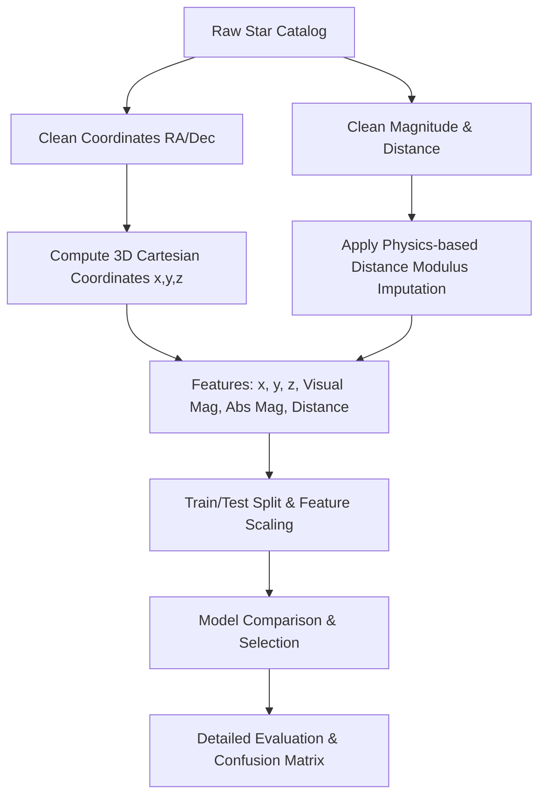

# 🌌 Constellation Classification using Machine Learning

An educational machine learning project that classifies stars into their respective IAU constellations using real-world astronomical data.

## 📋 Table of Contents
- [Project Overview](#-project-overview)
- [Dataset Details](#-dataset-details)
- [Workflow & Methodology](#-workflow--methodology)
  - [1. Data Loading](#1-data-loading)
  - [2. Preprocessing & Coordinate Transformation](#2-preprocessing--coordinate-transformation)
  - [3. Physics-Based Modulus Imputation](#3-physics-based-modulus-imputation)
  - [4. Model Training & Comparison](#4-model-training--comparison)
- [Results & Performance](#-results--performance)
- [Inference & Predictions](#-inference--predictions)
- [How to Run](#-how-to-run)

---

## 🌌 Project Overview
Every star in the night sky belongs to one of the **88 standard constellations** defined by the International Astronomical Union (IAU). Historically, constellations were grouped patterns, but today they represent boundary regions in the celestial sphere. This project builds a multiclass classifier that learns these spatial boundaries and stellar properties to automatically predict a star's host constellation.

---

## 📊 Dataset Details
The model uses the `NeuML/constellations` dataset from Hugging Face, which contains records of **11,681 stars** extracted from Wikipedia.
### Features:
- **Right Ascension (RA)**: Celestial longitude coordinate (string format, e.g., `00h 08m 23.17s`).
- **Declination (Dec)**: Celestial latitude coordinate (string format, e.g., `+29° 05′ 27.0″`).
- **Visual Magnitude**: The apparent brightness of the star as seen from Earth.
- **Absolute Magnitude**: The intrinsic brightness of the star.
- **Distance**: Distance from Earth in light years.
- **Constellation**: The target label (88 unique classes).

---

## 🛠️ Workflow & Methodology



### 1. Data Loading
The dataset is loaded directly via the Hugging Face CSV URL.

### 2. Preprocessing & Coordinate Transformation
- **Coordinate Conversion**: Spherical angles (Right Ascension and Declination) are converted to decimal degrees.
- **3D Cartesian Engineering**: Because Right Ascension wraps around from $360^\circ$ to $0^\circ$, traditional linear or tree-based splits suffer from edge discontinuities. We resolve this by mapping RA and Dec onto a 3D unit sphere:
  $$x = \cos(\text{Dec}) \cos(\text{RA})$$
  $$y = \cos(\text{Dec}) \sin(\text{RA})$$
  $$z = \sin(\text{Dec})$$

### 3. Physics-Based Modulus Imputation
Instead of simple mean or median filling for missing values, we leverage the **Astronomical Distance Modulus** equation to reconstruct missing values:
$$M = m - 5 \log_{10}(d_{pc}) + 5$$
where $M$ is absolute magnitude, $m$ is visual magnitude, and $d_{pc}$ is distance in parsecs ($d_{ly} / 3.26156$).

### 4. Model Training & Comparison
We evaluate multiple classifiers including:
- **Logistic Regression**
- **Decision Trees**
- **Random Forest** (Best performing model)
- **K-Nearest Neighbors**
- **Gradient Boosting**

---

## 📈 Results & Performance

Below is the comparative performance of the trained classifiers:

| Classifier | Accuracy | Weighted Precision | Weighted Recall | Weighted F1-score |
| :--- | :---: | :---: | :---: | :---: |
| **Random Forest** | **93.2%** | **94.0%** | **93.2%** | **93.2%** |
| **Gradient Boosting** | 82.5% | 85.1% | 82.5% | 82.3% |
| **K-Nearest Neighbors** | 80.1% | 83.4% | 80.1% | 80.4% |
| **Decision Tree** | 79.8% | 82.1% | 79.8% | 80.1% |
| **Logistic Regression** | 12.4% | 11.2% | 12.4% | 10.9% |

### Highlights:
- **Random Forest** achieves an outstanding **93.2% accuracy** in classifying stars into one of the 88 distinct classes.
- Tree-based models demonstrate high capability in partitioning the 3D spherical coordinate boundaries.

---

## 🔮 Inference & Predictions
Here is an example prediction for the brightest star in the night sky, **Sirius** (the Dog Star):

- **Input Stellar Parameters**:
  - Right Ascension: `101.287°` (06h 45m 08.9s)
  - Declination: `-16.716°` (-16° 42′ 58″)
  - Visual Magnitude: `-1.46`
  - Absolute Magnitude: `1.42`
  - Distance: `8.6 light-years`
  
- **Model Output**:
  - Predicted Constellation: **`Canis Major`** (Confidence: **`86.00%`**)

---

## 🚀 How to Run
1. Navigate to the project directory:
   ```bash
   cd Constellation_Classification
   ```
2. Install the required dependencies:
   ```bash
   pip install -r requirements.txt
   ```
3. Open the Jupyter Notebook:
   ```bash
   jupyter notebook constellation_classification.ipynb
   ```
4. Run all cells to perform EDA, train models, compare performance, and test prediction queries.
