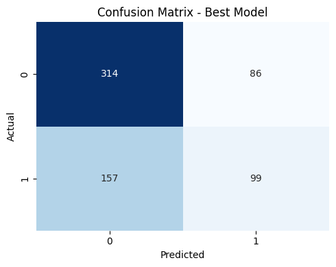
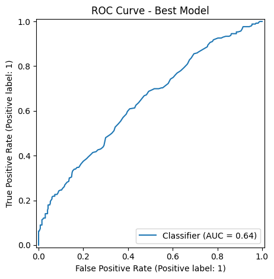
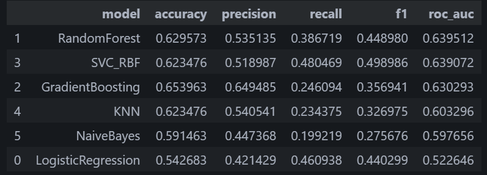

# Water Potability Prediction (ML)

**Project goal:** Predict whether a water sample is **potable (safe to drink)** using its **physicochemical properties**.

This project demonstrates an end-to-end **binary classification** workflow:
- Data preprocessing & cleaning
- Exploratory Data Analysis (EDA)
- Feature engineering
- Model comparison (multiple classifiers)
- Evaluation using **Accuracy, Precision, Recall, F1-score, and ROC-AUC**
- Prediction examples

> **Dataset:** Water Potability (commonly shared Kaggle dataset). 
> The notebook downloads/loads the dataset and produces the results.

---

## Screenshots




**When the notebook runs successfully, replace placeholders with real outputs:**
- Dataset overview (head/nulls): `./screenshots/dataset_overview.png`
- Class balance: `./screenshots/class_balance.png`
- Correlations heatmap: `./screenshots/correlation_heatmap.png`
- Confusion matrix: `./screenshots/confusion_matrix.png`
- ROC-AUC curve: `./screenshots/roc_auc_curve.png`
- Feature importance (permutation): `./screenshots/feature_importance.png`


---

## Results (example)

The notebook prints a metric table like:
- Accuracy
- Precision
- Recall
- F1-score
- ROC-AUC

And selects the best-performing model based on ROC-AUC / F1-score.



## Repository structure

```
Projects/Water Potability/
  water_potability.ipynb
  README.md
  screenshots/            # (optional) generated images
```

---

## How to run

1. Open `water_potability.ipynb` in Jupyter/VSCode.
2. Install requirements (see notebook cells).
3. Run top-to-bottom.
4. Save generated screenshots into `screenshots/` (optional but recommended).

---

## Notes / Conclusions

- Class imbalance is handled via class weights and/or threshold tuning.
- Feature scaling is applied where needed.
- Multiple models are compared to avoid selecting a single algorithm blindly.

---

## License

MIT

