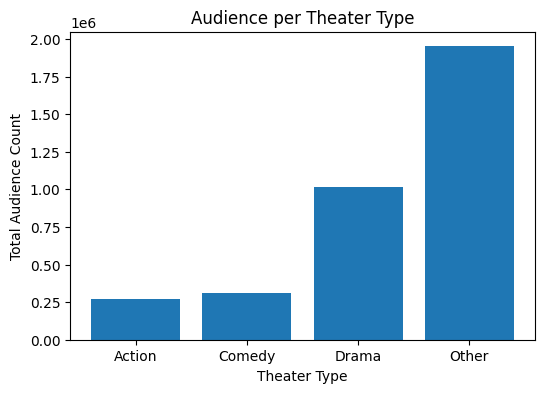
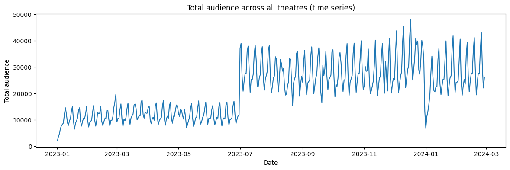
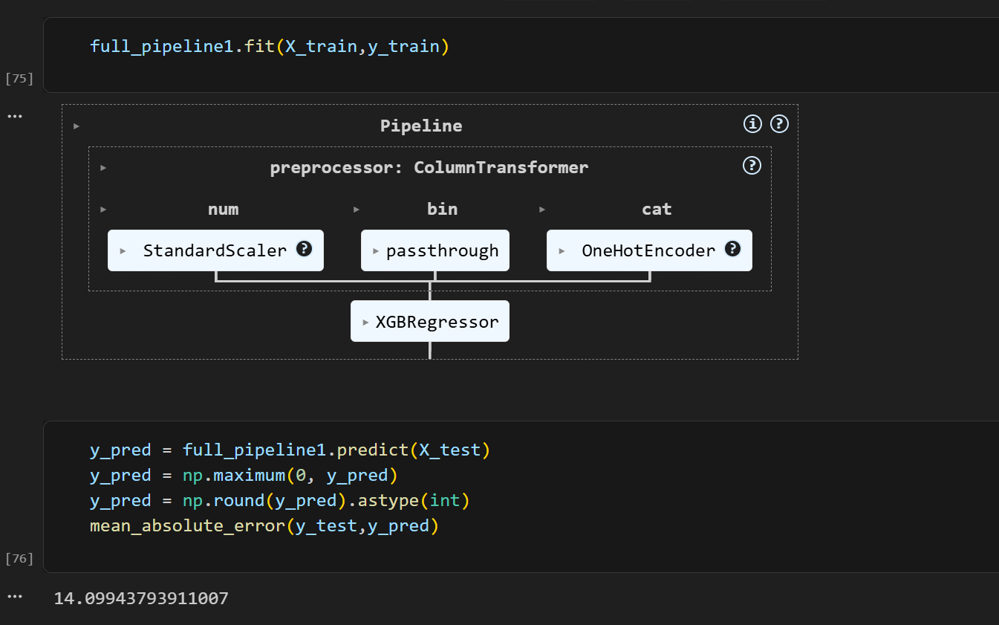

# Time Series Forecasting Models

A Time Series analysis project for forecasting the audience of a theatre based on the historical data. Engineered temporal, holiday, behavioral, and demand-signal features, handling cross-platform data alignment,
seasonality, trend patterns, and zero-demand/closure-day scenarios for robust forecasting. We use the XGBoost, LightGBM and Random Forest models for the project which uses the sequence of variable lengths to predict the future data values.


## Major Libraries Used:

- Numpy
- Pandas
- Matplotlib
- Seaborn
- Scikit Learn
- XGBoost
- LightGBM


## Implementation

To implement this project:

```bash
  load the dataset - [Theatre Audience Forecasting](https://www.kaggle.com/datasets/akshmahee/theatre-audience-forecasting)
  Install the libraries globally or locally for the project
  You may select the specific values for the date variables or may run the code as it is
```
## Output Screenshots

### Exploratory Data Analysis






### Model Evaluation




## Authors

- [@AkshitMaheshwari](https://www.github.com/AkshitMaheshwari)

